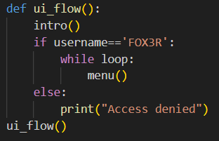
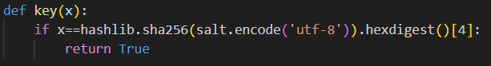
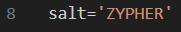
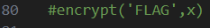
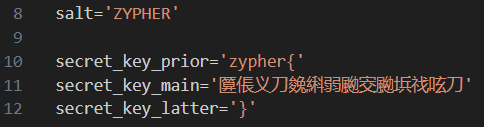
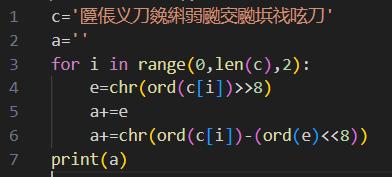
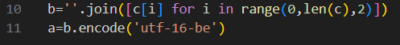

# Zypher-CTF-challenge-5.2
Zypher is a CTF conducted by CYSCOM VITC on 06/11/2023. This repository contains the challenge 5.2 and its corresponding walthrough.

**Challenge:**

You’re given a python file

<https://github.com/Anyr00d/Zypher-CTF-challenge-5.2/blob/main/Zypher_5.2.py>

**Solution:**

On running the file, it asks for the username that is ‘FOX3R’ as evident from this part of code:

After providing the username as input, we get some messages pertaining to the overall theme of the CTF event, ZYPHER.

Choosing the Rabbit option leads us to nowhere. It must be a rabbit hole as the name suggests.

Choosing the enter key option,it asks for a key that leads us to the key function

We can find x by running this piece of code(encrypting salt using SHA256 after encoding it in utf-8 format):

Now that we have found the key, let us inspect the encrypt() function:

We’ve found the key as 8.

The encrypt function takes the flag encrypts it with the key and returns the ciphertext(enc)

The program is prompting us to write a decrypt function to take the ciphertext and key as parameters and return the original flag.

Also the ciphertext is already given in this part of code:

Carefully investigating the encryption code, we see that the program shifts the bits for every other letter of the flag, left by 8 bits (1 byte). Then, it adds the next letter of the flag to the shifted value .Also every other letter of ciphertext is just a random character.

We can reverse this by first removing/skipping through the random characters.

Then we shift the bits right to get the first letter in the pair and convert the encoded character to bytes and get the last byte to get the second letter in the pair. The following code (<https://github.com/Anyr00d/Zypher-CTF-challenge-5.2/blob/main/decrypt.py>) demonstrates this:

Here ‘a’ is the final flag.We have step 2 in range to skip the random characters.

On running this decryption code,we get the flag as “**S4NI5Y\_17T6CT\_**”

**Alternative decryption code:**

**Final flag:** ZYPER{S4NI5Y\_17T6CT\_}
